# STM32 with VS Code — Setup Tutorial
### STM32-г VS Code дээр ажиллуулах заавар

> A step-by-step guide to setting up STM32 development in Visual Studio Code using ARM Clang and CMake.
>
> ARM Clang болон CMake ашиглан Visual Studio Code дээр STM32 хөгжүүлэлтийн орчин тохируулах алхам алхмаар заавар.

---

## Requirements / Шаардлага

- Visual Studio Code
- STM32 Extension Pack
- ARM Clang Toolchain
- CMake
- STM32 development board

---

## Setup Steps / Тохируулах алхмууд

---

### Step 1 — Open VS Code & Create a Profile
**VS Code-г нээх ба профайл үүсгэх**

Create a dedicated profile for STM32 development. This keeps your STM32 toolchain and CMake configuration isolated so they don't conflict with other projects.

> Профайл үүсгэснээр toolchain болон CMake нь бие биенээ гэмтээхгүй бөгөөд зөвхөн STM32-д зориулагдсан профайлыг хадгалах боломж олгоно.

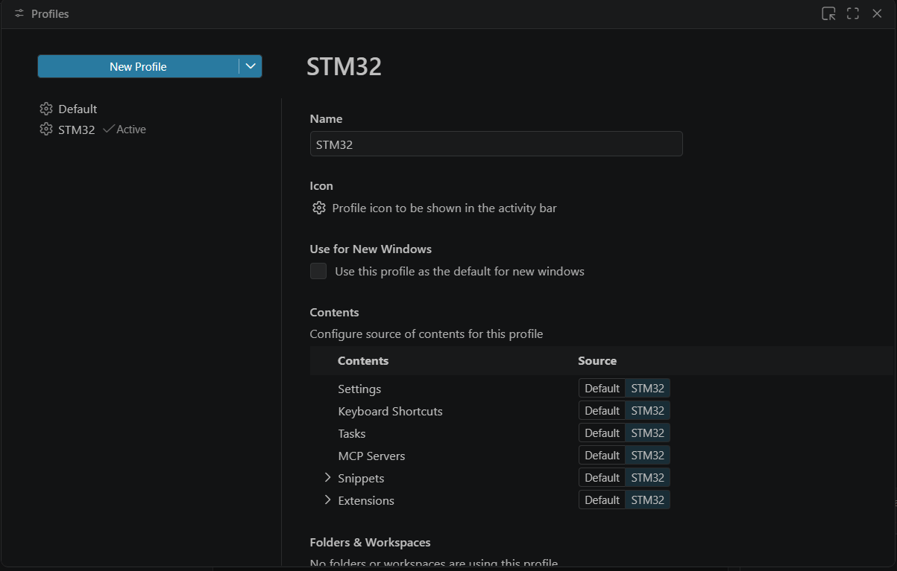

---

### Step 2 — Install the STM32 Extension Pack
**STM32 Extension Pack суулгах**

Search for and install the **STM32 Extension Pack** from the VS Code Extensions marketplace.

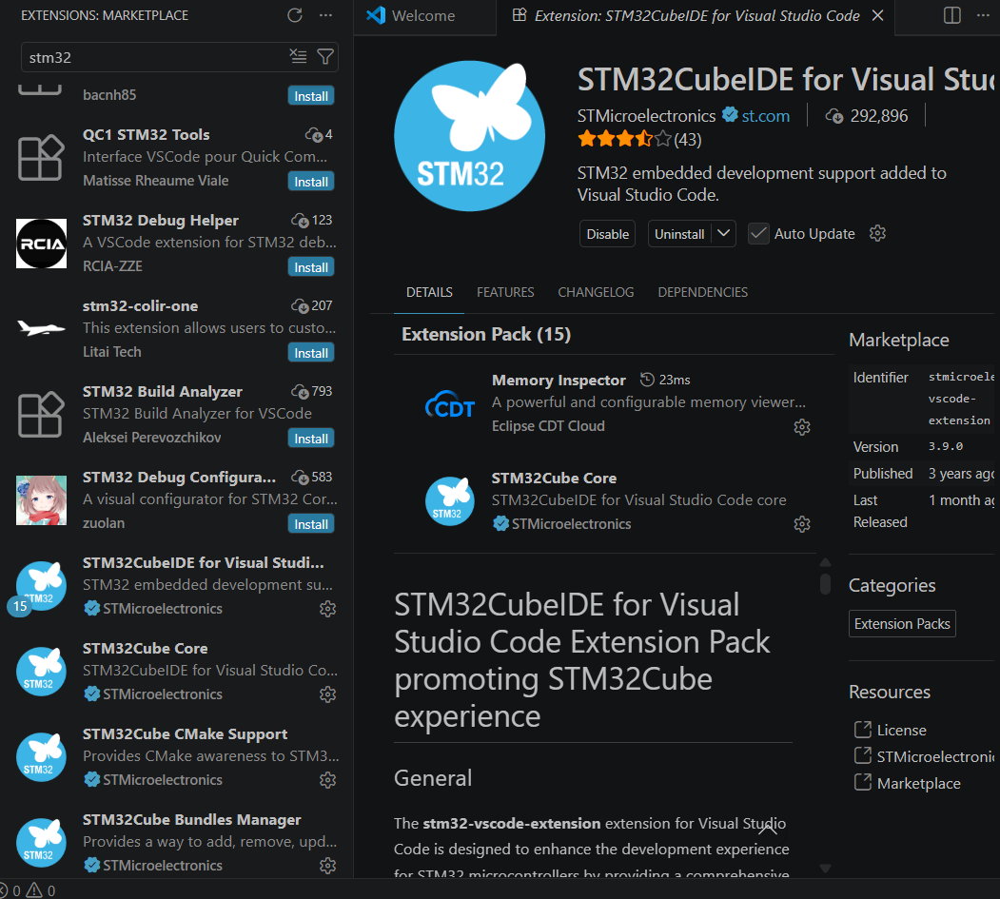

---

### Step 3 — Create Your Project Folder & CMake Files
**Кодын хавтас, CMake төслийг үүсгэх**

1. Create a new folder for your project, e.g. `MySTM32Project/`
2. Inside the folder, place your CMake files (`CMakeLists.txt` etc.) and the ARM Clang toolchain file

> Төсөл хадгалах шинэ хавтас үүсгэ. Хавтас дотроо CMake файлууд болон ARM Clang toolchain-т тохирсон toolchain файлыг байршуул.

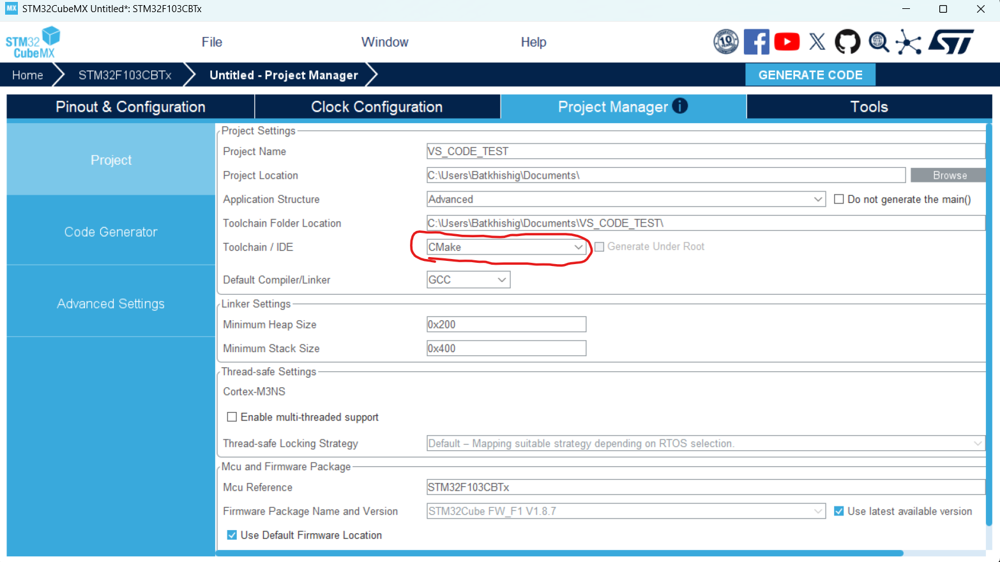

---

### Step 4 — Open the Folder in VS Code
**VS Code-д фолдерыг нээх**

Go to **File → Open Folder** and select your project folder.

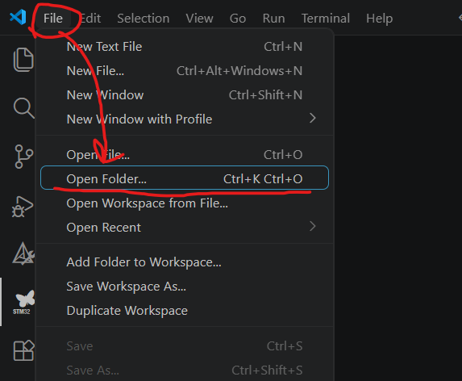

---

### Step 5 — Install Recommended Extensions
**Санал болгосон багцуудыг суулгах**

When VS Code opens your folder, it will prompt you to install required packages. Accept and install them.

> VS Code хавтсыг нээхэд шаардлагатай багцуудыг татаж авахыг асуух бөгөөд зөвшөөрч татаж авна.

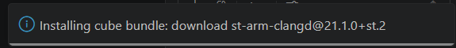

---

### Step 6 — Connect Your STM32 Board
**STM32 board-оо холбоно**

Plug in your STM32 board via USB. VS Code should automatically detect it.

> VS Code таны STM32 board-ыг автоматаар таних ёстой.

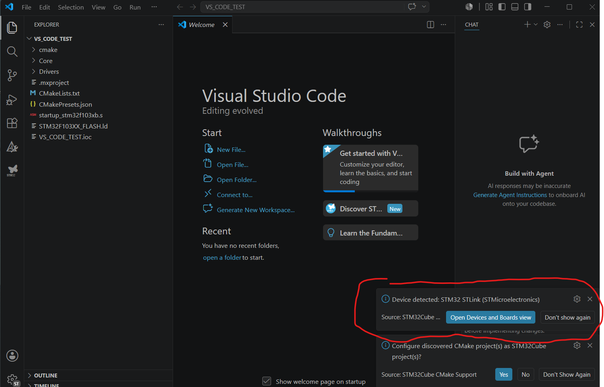

---

### Step 7 — Configure the Project via STM32 Extension
**STM32 extension-ээр төслийг тохируулах**

1. Open the **STM32 Extension sidebar**
2. Click **Configure Project** to set up your project settings

> STM32 extension-ийн sidebar руу орно. Дараа нь Configure Project дээр дарж төслийн тохиргоог хийнэ.

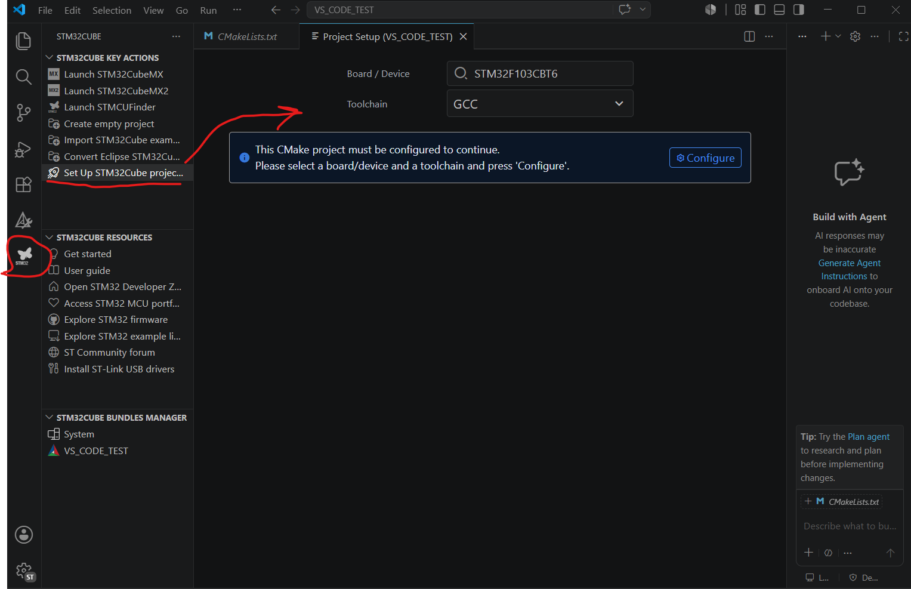

---

### Step 8 — Select Debug Configuration
**Debug тохиргоо сонгох**

Click **Configure**, then select **Debug**. Save the configuration screen that appears.

> Configure дээр дарж, Debug-ийг сонгоно уу. Үүний дараа энэ дэлгэц гарч ирнэ. Үүнийг хадгална уу.

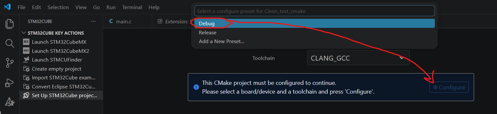
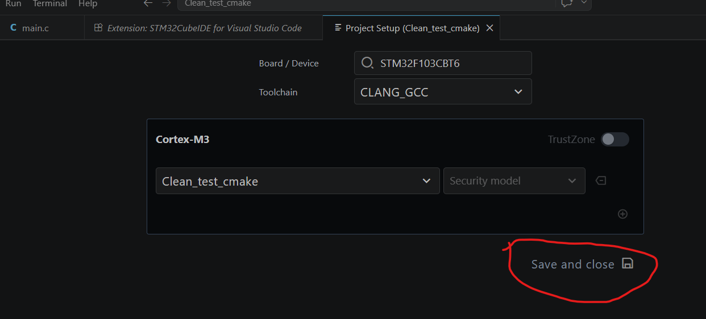

---

### Step 9 — JSON Config File is Generated
**JSON тохиргооны файл үүснэ**

A JSON configuration file will be automatically generated. You do not need to modify it unless you need custom boot/upload behaviour (e.g. auto-reset on upload).

> Энэ JSON файл автоматаар үүсэх бөгөөд тусгай ачаалах командууд тохируулах шаардлагагүй бол өөрчлөх хэрэггүй. Жишээлбэл, upload хийх үед програмыг автоматаар reset хийх зэрэг тохиргоонуудыг энд хийж болно.

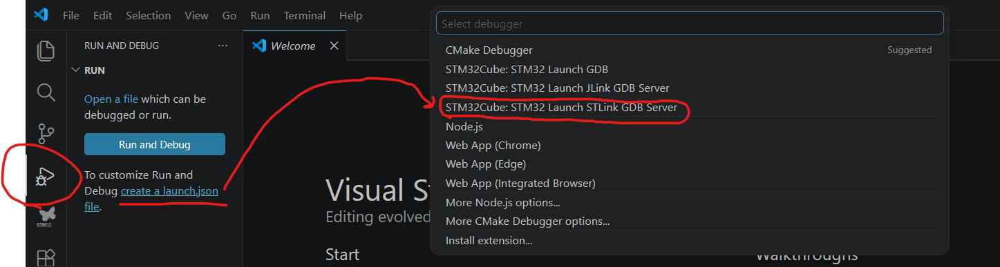
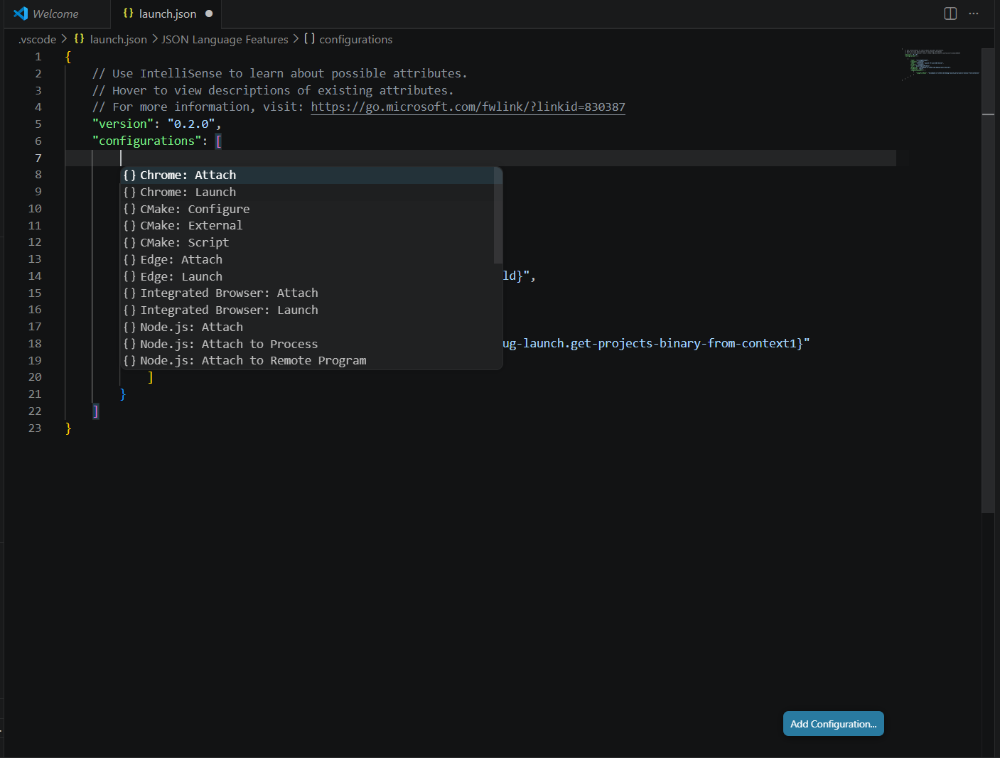

---

### Step 10 — Install C/C++ Extension & Disable IntelliSense
**C/C++ өргөтгөл суулгах ба IntelliSense идэвхгүй болгох**

VS Code will suggest installing the **C/C++ extension** — accept and install it. After installation, **disable IntelliSense** as it may conflict with the C/C++ functionality from the STM32 extension.

> Суулгаж дууссаны дараа энэ өргөтгөл нь IntelliSense-ийн C/C++ функцтэй зөрчилдөж болзошгүй тул IntelliSense-ийг идэвхгүй болгоно уу.

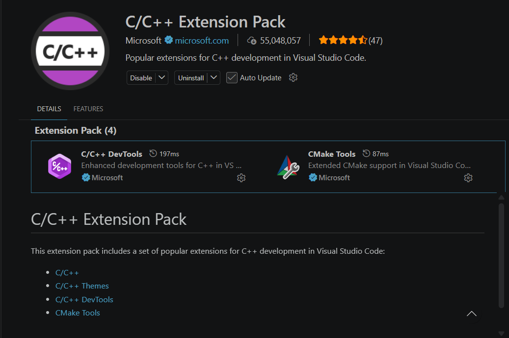
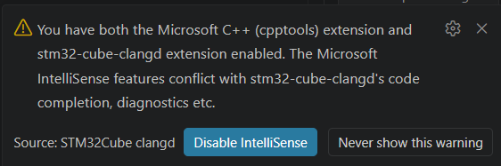

---

### Step 11 — Setup Complete, Build & Debug
**Тохируулга дууслаа — Build ба Debug хийх**

Setup is now complete. You can build and debug your project using the shortcuts below.

> Ingэд тохиргоо бүрэн дууслаа. Та одоо төслөө build хийж, debug хийж програмын ажиллагааг шалгах боломжтой.

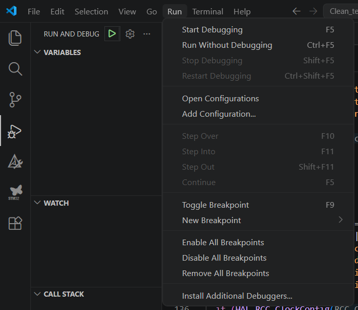

---

## Shortcuts / Товчлол

| Action | Shortcut |
|--------|----------|
| **Build** the project | `Ctrl + Shift + B` or `F7` |
| **Debug** the project | `F5` |

---

## Video Tutorial / Видео заавар

▶️ [https://youtu.be/CDqQXCO6F4A?si=kjiiGDa5lexTM1Wq](https://youtu.be/CDqQXCO6F4A?si=kjiiGDa5lexTM1Wq)

---

## Related / Холбоотой

👉 [STM32-GPIO-Toolchain-Benchmark](https://github.com/YOUR_USERNAME/STM32-GPIO-Toolchain-Benchmark)

---

*STM32 VS Code Setup Tutorial | ARM Clang + CMake*
